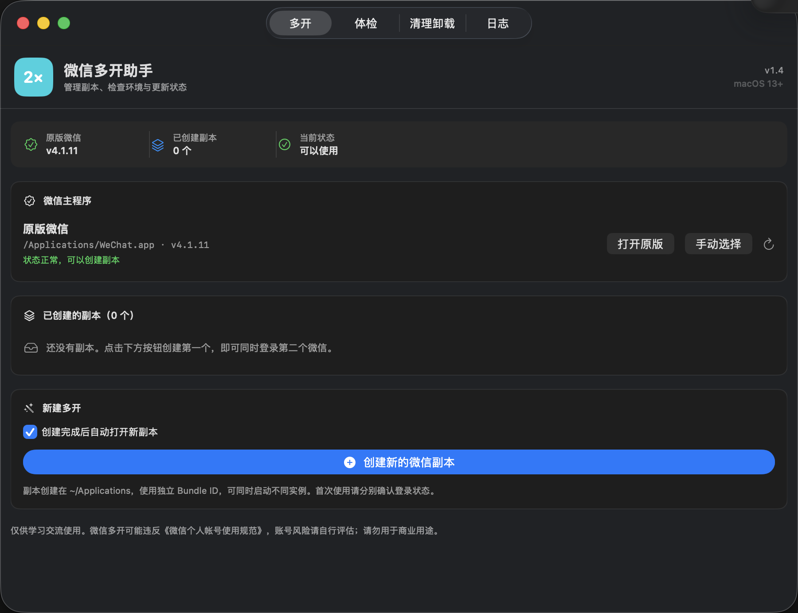
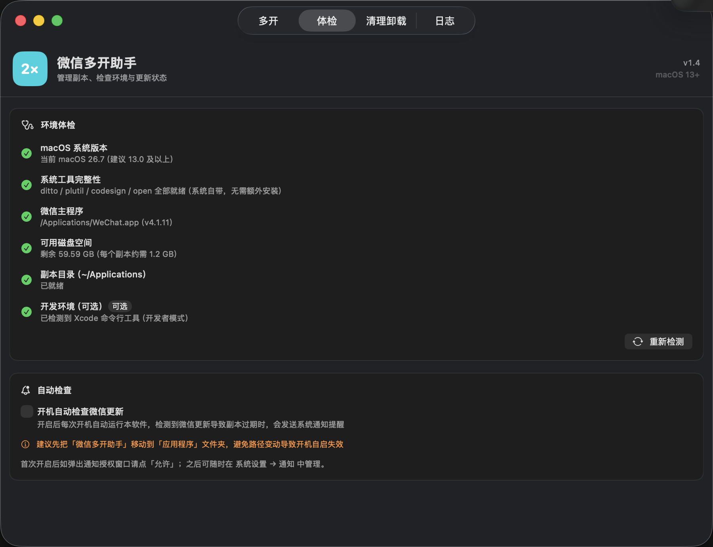
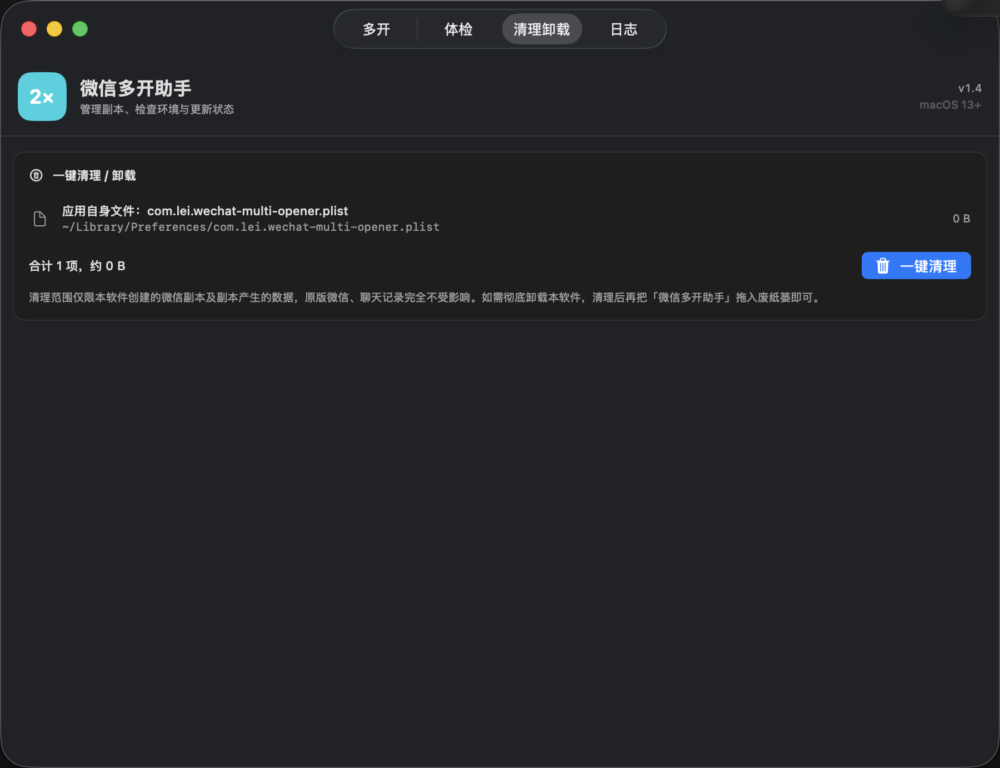
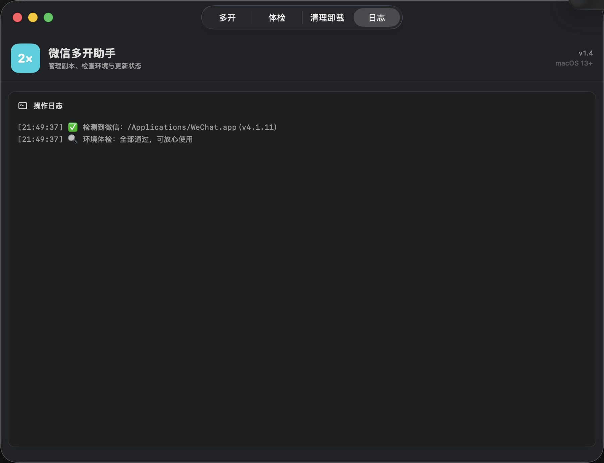

# 使用教程

## 1. 获取项目

推荐从 [GitHub Releases](https://github.com/unilei/wechat-multi-opener/releases) 下载，并核对 Release 页面提供的 SHA-256。开发者或希望自行审计的用户可以直接克隆源码构建。

## 2. 首次启动

把 App 放入“应用程序”文件夹，然后打开“微信多开助手”。首次运行如果出现 Gatekeeper 提示，请先核对来源和 SHA-256，再用 Finder 右键“打开”。

## 3. 环境体检

切换到“体检”页，确认 macOS、系统工具、原版微信和磁盘空间状态。运行已构建好的 App 不需要安装 Xcode；只有从源码执行 `build.sh` 才需要 Command Line Tools。

## 4. 创建与打开副本

回到“多开”页，点击“创建新的微信副本”。复制和签名期间不要关闭窗口。创建完成后，副本默认位于 `~/Applications`；如果开启了自动打开，会立即启动副本。

每个副本首次使用都应按微信界面独立登录。不要把“创建成功”理解成“登录成功”。

## 5. 更新与重建

当原版微信升级，主界面会显示过期副本数量。点击“一键重建”后，等待进度完成；重建后检查每个副本的登录状态和通知授权。

## 6. 清理和卸载

进入“清理卸载”页，确认扫描结果后执行清理。副本 App 和副本容器会优先移到废纸篓，原版微信不会被列入清理范围。

操作日志可以帮助你在反馈问题时提供可复现信息，但请先删除路径中的个人姓名和其他敏感信息：

